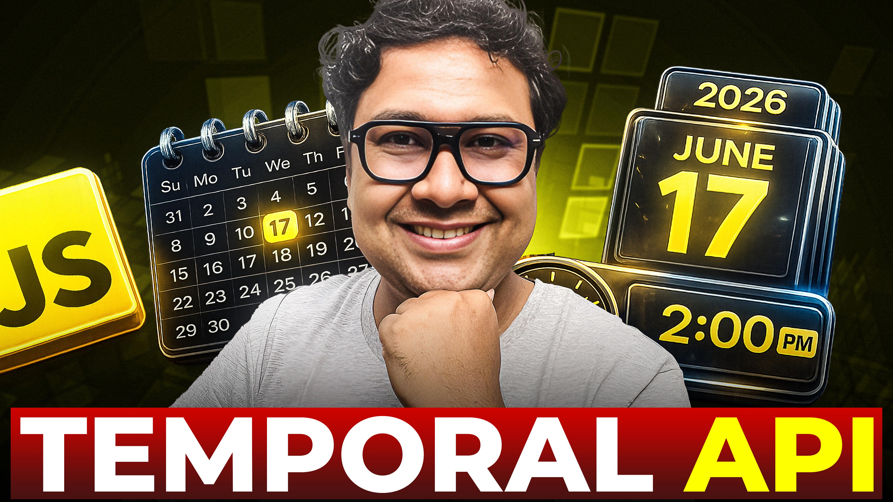

# Day 41 - MASTERING Date in JavaScript - Temporal API

## 🫶 Support

Your support means a lot.

- Please SUBSCRIBE to [tapaScript YouTube Channel](https://youtube.com/tapasadhikary) if not done already. A Big Thank You!
- Liked my work? It takes months of hard work to create quality content and present it to you. You can show your support to me with a STAR(⭐) to this repository.

    > Many Thanks to all the `Stargazers` who have supported this project with stars(⭐)

### 🤝 Sponsor My Work

I am an independent educator and open-source enthusiast who creates meaningful projects to teach programming on my YouTube Channel. **You can support my work by [Sponsoring me on GitHub](https://github.com/sponsors/atapas) or [Buy Me a Cofee](https://buymeacoffee.com/tapasadhikary)**.

## **PART 3: 🎯 Goal of This Lesson**

- ✅ The JavaScript Date Object History
- ✅  What Is This Session About?
- ✅  The JavaScript Date Object Bugs
- ✅  Introduction To Temporal API
- ✅  Temporal Types
- ✅  JavaScript Date Object vs. Temporal API
- ✅  Temporal Support
- ✅  Source Code
- ✅  What’s Next

## Video

Here is the video for you to go through and learn:

